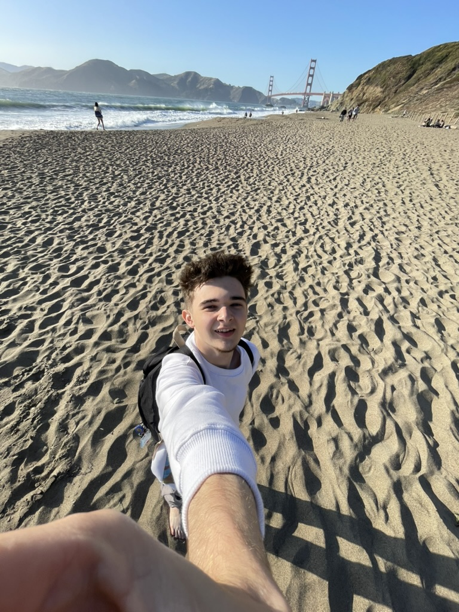
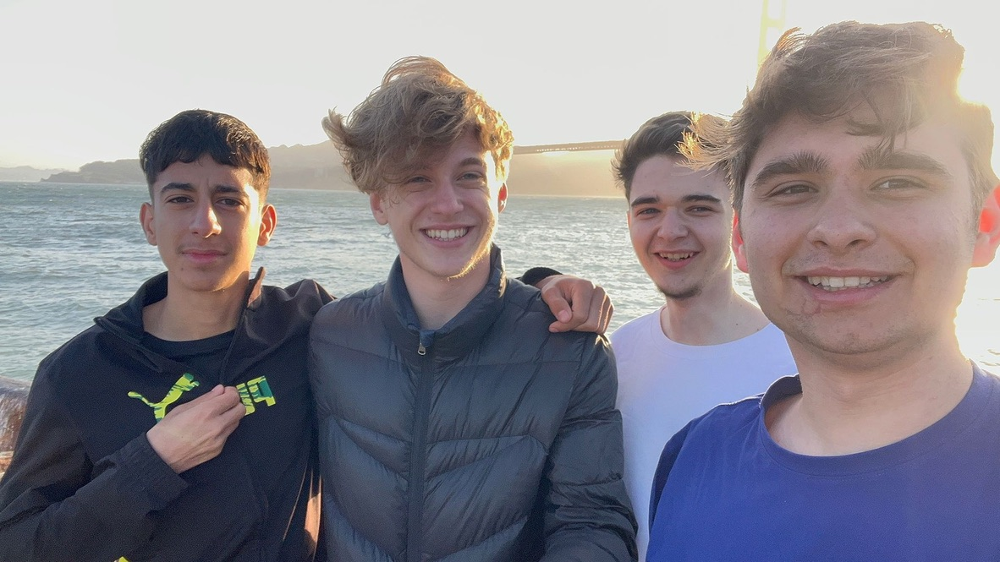

neighborhood *was* a hack club summer program! if you made a project for about ~100h, you were guaranteed housing, food & flight stipend to go to San Francisco! you could have stayed the whole summer as long you were shipping projects and working ~40h p/w.

---
## my project [hackacode](https://github.com/suceavahacks/hackacode)

hackacode is a vibey competitive programming platform where you can solve coding challenges, duel with friends, and enjoy coding in a chill environment. the platform combines next.js, typescript, and supabase on the frontend with a high-performance go-based code judge on the backend.

so, yeah, i worked ~100h on this project! i had worked on a similar project before, [infoconquer](https://github.com/xndadelin/Info-Conquer). but now i used more modern technologies and managed to add a lot more functionalites! it really shows my improvement as a developer since i worked on [infoconquer](https://github.com/xndadelin/Info-Conquer).

---

## my journey
because i am romanian, i needed a visa! it took 2 weeks from when i completed my ds160 form and actually getting my passport with the visa back. the process went smoothly. now i have a 10 year tourist visa to go to the US!

i arrived in san francisco on the 16th of july. i passed through customs in dublin, so i went directly to get the bart to mission, the district where my house is. the first smell i felt when i was leaving the 24th street mission bart station was poop. yeah, this district smells a lot of poop! in the financial district it's a bit better. 

i met with my romanian friends, cosmin & simone, and they led me to atelier (the mission house). they showed me the house, the district a little bit and went to golden gate with everyone else! the ggb is really big! i had a lot of fun with them! we went to pier 39, fisherman's wharf, saw the 4th of july fireworks, the dolores park, the painted ladies & a lot more!

most of the time i was supposed to code, but i managed to see a lot of the city! in july, our romanian gang doubled! i think we were the nation with the most people in neighborhood?! (11 people, which is about 18.3% of all students)

<iframe src="https://streamable.com/e/76hyt9" frameborder="0" allowfullscreen></iframe>

## unfortunate turn of events
so there was a worried neighbor at the sunset house, so she/he called the CPS and the police :(. the cps & the police actually found this program to be super cool and decided not to do anything, but that was the straw that broke the camels back for the organizing team. so they decided to end the program. i was supposed to leave on the 28th of july! but anyway, they were super cool and bought my return ticket ASAP and now leaving on the 17th of july! 

it is an unfortunate turn of events, but i want to thank thomas for giving me the chance to actually go to san francisco! it is the most exciting adventure i have ever taken part of and i will always remember this journey.